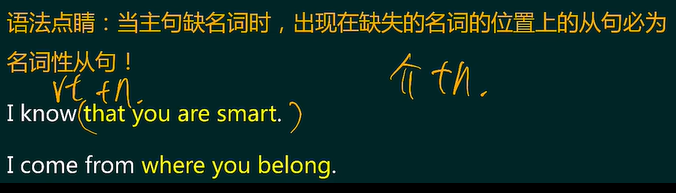
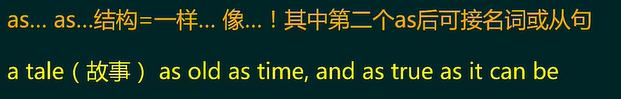
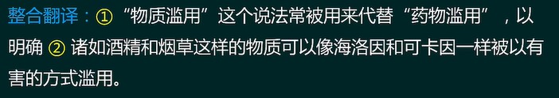
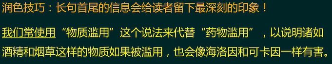

# 一、目录

[TOC]

# day1

# day2

# day3

# day4

**The phrase "substance abuse" `is` often used instead of "drug abuse" to make clear** `that` substance such as alcohol and tobacco `can` be just as harmfully misused as heroin and cocaine.

phrase n.说法，措辞，话术，短语

substance n.物质，实质，基础 

substantial adj.重大的，实质性的

中国在扶贫（poverty alleviation）上取得了实质性的进展。

instead of 以代替

make sth adj 使某物变得...  ->  make sth clear , make clear sth

such as 诸如，像 

 alcohol n.酒精

tobacco n.烟草

misuse v.误用，滥用

heroin n.海洛因

cocaine n.可卡因

​						像从照片里看到的一样美

# day8

*[The test of any democratic society] `lies` [not in]* `how` well it `can` control expression *[but in]* `whether` it `gives` freedom of thoughtand expression the widest possible latitude, `however` disputableor irritating the results `may` sometimes be.

`语法点睛：出现在介词，冠词后面的词一般都是名词，而不是动词`

**主句 : The test of any democratic society lies not in... but in...**

初步翻译:任何一个民主社会的考验不在于...而在于

**名从1 : how well it can control expression**

`语法点睛: how+adi./ady.+主干型从句`

`一般将how+adi./adv.置于谓语后或句尾来翻译理解`
I don' t care **how old** you are.

I don' t care **you are how old**

 it can control expression how well

初步翻译：它能将表达控制的多好

**名从2：whether it gives freedom of thought and expression the widest possible latitude**
`语法点睛 : whether! if 导名从时翻译成“是否，放在从句谓语前`
初步翻译:它是否给予思想和表达最宽泛的自由

**修饰1. : however disputable or irritating the results maysometimes be.**

`语法点睛 : however 引导状语从句时( 必然伴随adj./adv.) ，首先将however 改成 no matter how，再将 how+adj./adv. 后置即可`

**no matter how** disputable or irritating the results may sometimes be

no matter the results may sometimes be **how disputable or irritating**

初步翻译: 无论结果有时可能多么的有争议或令人闹心

整合翻译: 任何一个民主社会的考验不在于[它能将表达控制的多好]，而在于[它是否给予思想和表达最宽泛的自由] ，无论结果有时可能多么的有争议或令人闹心。

润色：考验一个社会是否民主，重点并不在于它对于舆论的控制有多到位而在于它是否能给予思想和言论以最大限度的自由，无论这可能产生多么有争议或令人闹心的结果。

**词汇、短语**
test n.考试，测试，测验，考验
democratic adj.民主的
dem=人民         demographic adj.人口的，人口学的 n.人口数据

lie v.躺在;处于    过去式 :lay 过去分词 :lain
lie v. 撒谎  过去式:lied 过去分词 : lied

lie tt sb.对某人撒谎
lie about sth 在某事上说谎
expression n.表情，表情包;表达  meme n.梗图 

give A B (双宾结构)给A B
freedom n.自由

latitude n.纬度->宽->选择的自由  altitude n.海拔高度
disputable adj.有争议的，有待商榷的irritating adj.恼人的，气人的，闹心的

# day9

`Though` some of us `have` known for many, many years `that` the freedoms under the First Amendment `are` not totally unlimited, I `think`  `(that)`  it `is` perhaps the case `that` some people associated withthe company `have` only recently come to realize this.

**主句: I think (that)... it is perhaps the case**

初步翻译:我认为当前情况可能是it

`语法点睛:只有this能指代前文某句话所述的事，it无此作用`
无具体指代对象的it搭配that一起出现时，常涉及形式主语、形式宾语、强调句等结构,且形主、形宾出现的概率远高于强调句。

**主语从句: that some people (that be) associated with the company haveonly recently come to realize this.**

`语法:修饰性非谓语（定、状)优先尝试“加be 或去 ing，补 that"`

主句整合翻译:
我认为当前情况可能是，一些与公司有关的人最近才意识到这件事。

**修饰1: Though some of us have known for many, many years**

`语法点睛:逗号一般没有实际语法作用，只标志语气的停顿或在一定程度上提示读者句子的结构。`

整合翻译:虽然我们中的一些人已经知道很多很多年了

**名从: that the freedoms under the First Amendment are nottotally unlimited,**
初步翻译:宪法第一修正案下的自由并不是完全不受限制的

整合翻译:
虽然我们中的一些人已经知道很多很多年了,宪法第一修正案下的自由并不是完全不受限制的，我认为当前情况可能是，一些与公司有关的人最近才意识到这件事。

润色：虽然我们大部分人很早就已经知道宪法第一修正案赋予的自由不是全无限制的，但我认为公司的一些相关人士最近才刚刚意识到这一点。

**词汇、短语∶**
perhaps adv.或许，可能

case n.案子;情况∶事例
sth is the case=the case is sth 当前情况是sth 
associate v.关联，联系

associate A with B将A与B关联起来

come to do sth 开始做某事
realize v.意识到;实现

freedom n.自由
the First Amendment n.（宪法）第一修正案   

the Constitution n.宪法
unlimited adj.不受限制的

# day10

Much of the language used to describe monetary policy, such as "steering the economy to a soft landing"or "a touch on the brakes” , `makes` it sound like a precise science.

**主句:Much of the language used to describe monetary policy makes it sound like a precise science.**

`语法点睛:make sb do sth, let sb do sth 等结构由于平时生活中会大量应用,为了提高表达效率，都省略了to do的to`

`语法点睛:use做谓语时的几个重要词组`

be used to do sth  被用来做某事…

be used to sth  适应、习惯了某件事

used to do sth  过去常常，曾经做某事

Much of the language **(that be)** used to describe

初步翻译:许多用于描述货币政策的语言使之听上去像是一门精确的科学。

**修饰①: such as "steering the economy to a soft landing"or"a touch on the brakes"**
`语法点睛∶结尾加了ing , ed的词，其原型一般都具备动词词性`

整合翻译:许多用于描述货币政策的语言，诸如“引导经济软着陆”或“轻踩刹车”，使之听上去像是一门精确的科学。

润色：许多用于描述货币政策的语言，诸如“引导经济软着陆”或“轻踩刹车”，都使它听上去像是一门精确的科学。

`小技巧:合理利用语境和读者的主观能动性来避免歧义`

**词汇、短语:**
monetary adj.货币的
sound v.听上去adj.有说服力的→坚实可靠的

precise adj.精细的，准确的
steer v.引导，操控，控制→掌舵
land n.陆地，土地  v.着陆，降落

soft landing n.软着陆
hard landing n.硬着陆

**通识拓展：**

货币政策 monetary policy

财政政策 fiscal policy

# day11

Perhaps it `is` humankind'’s long suffering at the mercy of flood and drought `that`  `makes`  the idea of forcing the waters to do our bidding so fascinating.

**主句：Perhaps it is humankind'’s long suffering at the mercy of flood and drought**

`语法点睛:it... that结构中，that从缺成分时才是强调句。`

`句中的it is/was一般可翻译成“正是”，随所强调内容放回原句首尾。`

It was the PLA that fought day and night to help us resist theflood. (PLA=People's Liberation Army of China中国人民解放军)

帮助我们日夜抗击洪水的正是中国人民解放军

初步翻译:也许正是人类长期在洪水和干旱支配下所遭受的苦难

**修饰1：that makes the idea of forcing the waters to do our bidding so fascinating.**

初步翻译:使得迫使水流按我们的意志行事的想法变得如此迷人.

整合翻译：也许正是人类长期在洪水和干旱支配下所遭受的苦难使得迫使水流按我们的意志行事的想法变得如此迷人。

润色：或许正是洪水与干旱长久以来的蹂躏，使得强迫水流服从人类的意志这个想法异常迷人。

润色终版：或许正是洪水与干旱长久以来的蹂躏，使得人类异常渴望支配水流。

**词汇、短语∶**
suffer v.遭受，受苦
suffering n.折磨，苦难
mercy n.仁慈，宽恕
Show mercy! 行行好吧

No mercy!片甲不留
at the mercy of 拜某人所赐﹔任凭某人摆布

flood n.洪水

drought n.干旱

force n.力量;势力v.强迫，迫使force sb to do sth迫使某人做某事

bid v.出价，竞标→想要获得→bidding n.请求，吩咐;出价，竞标

do one’ s bidding 按某人的意愿行事

fascinating adj.迷人的

# day12

The Aswan Dam, for example, `stopped` the Nile flooding `but` `deprived` Egypt of the fertile silt `that` floods `left`—all in return for a giant reservoir of disease `which` `is` now so full of silt `that` it barely `generates` electricity.

**主句：The Aswan Dam, for example, stopped the Nile flooding but deprived Egypt of the fertile silt**

初步翻译∶例如，阿斯旺大坝阻止了尼罗河的泛滥，但却使埃及失去了肥沃的泥沙

**修饰1： silt that floods left**

初步翻译：洪水留下的泥沙

**修饰:2：all in return for a giant reservoir of disease**

初步翻译:这一切换来的是一个充满疾病的巨大水库

`语法点睛:A of B的三种常见译法`
`1.B的A`
the plan of travellingthe prisoner of Azkaban

`2.A的B(当A为量词时)`

five percent of students
a tremendous amount of work
`3.有B的A，由B构成的A`
a man of taste
the chamber of secrets 

**修饰3：which is now so full of silt that it barely generates electricity**

`语法点睛:so+adj.+that 与such+n.+that，表示“如此...以至于..."`

Lisa is **so beautiful that** Johnson falls in love with her at first sight.

Lisa is **such a beautiful girl that** Johnson cannot take his eyes off her.

初步翻译:它现在满是泥沙，以至于几乎无法发电。
`语法:定语从句【未必】修饰离它最近的名词!代词未必指代最近的名词!`

整合翻译：例如，阿斯旺大坝阻止了尼罗河的泛滥，但却使埃及失去了洪水留下的肥沃的泥沙。这一切换来的是一个充满疾病的巨大水库,它现在满是泥沙，以至于几乎无法发电。
润色：例如，阿斯旺大坝止住了尼罗河的泛滥，但也使埃及丧失了洪水带来的肥沃淤泥。这一切最终换来的是一座充满病菌的巨大水库,那里如今满是泥沙，几乎无法发电。

**词汇、短语︰**

dam n.大坝
deprive v.剥夺，使失去

deprive A of B使A失去B，剥夺A的B

fertile adj.肥沃的，富饶的
fertilizer
silt n.（沉积的）泥沙
in return for B 作为B的回报;为了换取B
in return 作为回报
They give me money in return for my service.
They give me money. In return, I work.
all for sth 全是为了...
all for nothing徒劳无功
giant adj.巨大的 n.巨人
tech giant科技巨头
reservoir n.水库

barely adv.几乎不~hardly
electricity n.电力 

EV= electric vehicle 电动车

# day16

The true enemies of science, argues Paul Ehrlich of StanfordUniversity, a pioneer of environmental studies, are those whoquestion the evidence supporting global warming, the
depletion of the ozone layer and other consequences ofindustrial growth.

# day18

The complementary coastlines and certain geological features `that` `seem` to span the ocean `are` reminders of `where` the two continents `were` once joined.

**主句：The complementary coastlines and certain geological features  are reminders of**

初步翻译:互补的海岸线和某些地质特征是….的提示物

**名从：where the two continents were once joined**

`语法点睛:5W1H类名从引导词可转换成“名词+定语从句”理解`

where = the place that

when = the time that

what = the thing that

who = the person that

why = the reason that

how = the way that(不带adj./adv.尾巴)

初步翻译：两块大陆曾经相连的地方

**geological features that seem to span the ocean**

初步翻译：似乎跨越海洋的地理特征

整合翻译:互补的海岸线和某些似乎横跨海洋的地质特征，是【两块大陆曾经相连的地方】的提示物。
润色：*大洋两侧遥相呼应的海岸线*和某些相似的地质特征提示着我们，两块大陆曾**在此**相连。

我的翻译：互补的海岸线和某种似乎跨越了海洋的地理特征是两块大陆第一次连接的提示

（where没翻译出来，were once joined翻译错了）

**词汇、短语**
complementary adj.互补的

coastline n.海岸线
certain adj.特定的;某些

feature n.特点，特色

reminder n.提示物，提示

continent n.大陆join v.连接，结合

span v.跨越n.宽度
